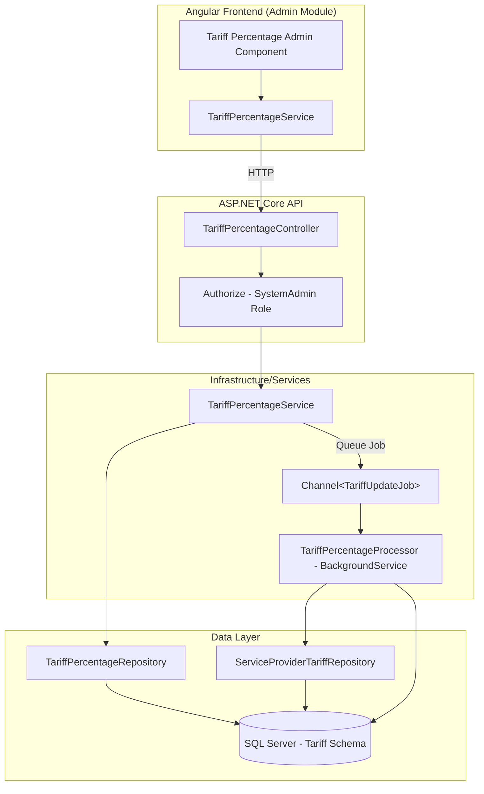
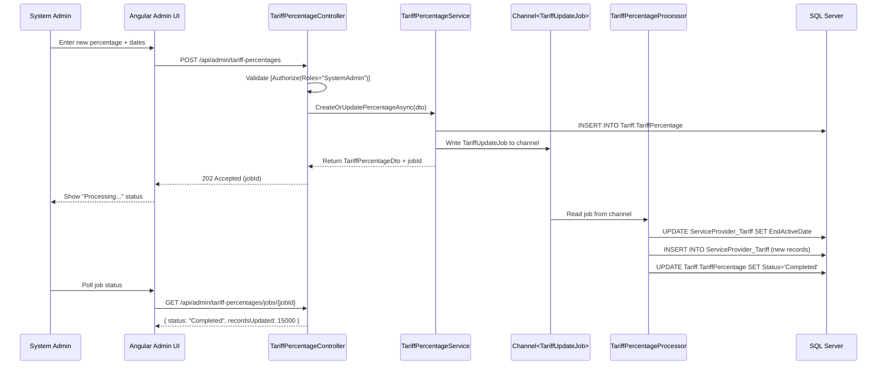
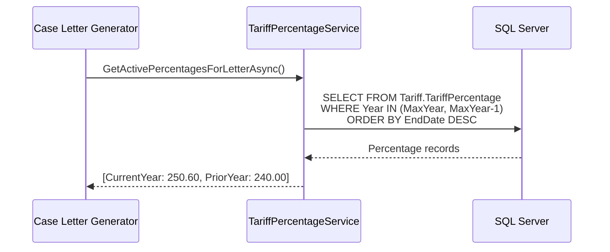

# Design Document: Tariff Percentage Management

## Overview

This feature replaces the manual SQL-based tariff percentage update process with an admin UI and automated background processing. System administrators will manage tariff percentages through a dedicated admin table, specifying start/end dates and percentage values per period. When percentages are saved, a background job propagates changes to the `[Tariff].[ServiceProvider_Tariff]` table — closing out existing active records and inserting new ones with the updated percentage.

Case letters will dynamically pull tariff percentages from this management table for the most recent two years (max year and max year - 1), using the latest end dates to handle intra-year changes.

The system uses ASP.NET Core's built-in `IHostedService` with `System.Threading.Channels` for background processing, keeping infrastructure dependencies minimal while handling the long-running bulk update operations.

## Architecture



## Sequence Diagrams

### Admin Updates Tariff Percentage



### Case Letter Retrieves Percentages



## Components and Interfaces

### Component 1: TariffPercentage Entity (New Table)

**Purpose**: Stores managed tariff percentage configurations with date ranges, replacing manual SQL updates.

**Schema**: `[Tariff].[TariffPercentage]`

```csharp
[Table("TariffPercentage", Schema = "Tariff")]
public class TariffPercentage : BaseEntity
{
    [Key]
    [DatabaseGenerated(DatabaseGeneratedOption.Identity)]
    public int TariffPercentageId { get; set; }

    [Column(TypeName = "decimal(10, 4)")]
    public decimal PercentageAdded { get; set; }

    public int TariffPeriodName { get; set; } // Year (e.g., 2026)

    public DateOnly StartActiveDate { get; set; }

    public DateOnly? EndActiveDate { get; set; }

    [MaxLength(50)]
    public string? Status { get; set; } // Pending, Processing, Completed, Failed

    public int? RecordsAffected { get; set; }

    [MaxLength(500)]
    public string? Notes { get; set; }
}
```

**Responsibilities**:
- Store the authoritative tariff percentage per period
- Track processing status of propagation to ServiceProvider_Tariff
- Support intra-year changes via multiple records per year with different date ranges

### Component 2: ITariffPercentageService

**Purpose**: Business logic for managing tariff percentages and triggering propagation jobs.

```csharp
public interface ITariffPercentageService
{
    // CRUD Operations
    Task<IEnumerable<TariffPercentageDto>> GetAllAsync();
    Task<TariffPercentageDto?> GetByIdAsync(int id);
    Task<TariffPercentageDto> CreateAsync(CreateTariffPercentageDto dto);
    Task<TariffPercentageDto> UpdateAsync(int id, UpdateTariffPercentageDto dto);
    Task<bool> DeleteAsync(int id);

    // Propagation
    Task<TariffUpdateJobStatus> ApplyPercentageAsync(int tariffPercentageId);
    Task<TariffUpdateJobStatus> GetJobStatusAsync(string jobId);

    // Case Letter Support
    Task<IEnumerable<TariffPercentageDto>> GetActivePercentagesForLetterAsync();
}
```

**Responsibilities**:
- Validate percentage input (positive decimal, valid date ranges)
- Queue propagation jobs to background processor
- Provide case letter query for most recent 2 years
- Track job status for frontend polling

### Component 3: TariffPercentageProcessor (Background Service)

**Purpose**: Processes queued tariff update jobs by bulk-updating the ServiceProvider_Tariff table.

```csharp
public class TariffPercentageProcessor : BackgroundService
{
    private readonly Channel<TariffUpdateJob> _channel;
    private readonly IServiceScopeFactory _scopeFactory;
    private readonly ILogger<TariffPercentageProcessor> _logger;

    protected override async Task ExecuteAsync(CancellationToken stoppingToken);
}
```

**Responsibilities**:
- Read jobs from the channel queue
- Execute bulk UPDATE (close existing) + INSERT (new records) in a transaction
- Update TariffPercentage status on completion/failure
- Log progress and handle errors gracefully

### Component 4: TariffPercentageController

**Purpose**: API endpoints for admin management of tariff percentages, restricted to SystemAdmin role.

```csharp
[ApiController]
[Route("api/admin/tariff-percentages")]
[Authorize(Roles = "SystemAdmin")]
public class TariffPercentageController : ControllerBase
{
    [HttpGet] // Get all tariff percentages
    [HttpGet("{id}")] // Get by ID
    [HttpPost] // Create new percentage
    [HttpPut("{id}")] // Update existing
    [HttpDelete("{id}")] // Soft-delete
    [HttpPost("{id}/apply")] // Trigger propagation job
    [HttpGet("jobs/{jobId}")] // Poll job status
    [HttpGet("active-for-letter")] // Case letter percentages
}
```

**Responsibilities**:
- Enforce SystemAdmin authorization
- Delegate to ITariffPercentageService
- Return standard ApiResponse<T> wrappers
- Return 202 Accepted for async propagation operations

### Component 5: Angular Admin UI

**Purpose**: Admin table for viewing, creating, and editing tariff percentages with job status feedback.

```typescript
// Route: /admin/tariff-percentages
@Component({
  selector: 'app-tariff-percentage-management',
  standalone: true,
  templateUrl: './tariff-percentage-management.component.html'
})
export class TariffPercentageManagementComponent {
  percentages: TariffPercentage[] = [];
  isProcessing: boolean = false;
  jobStatus: TariffUpdateJobStatus | null = null;
}
```

**Responsibilities**:
- Display table of tariff percentages with period, dates, percentage, status
- Inline create/edit form for new percentage entries
- "Apply" button to trigger propagation with confirmation dialog
- Poll and display job progress/status
- Restrict access via roleGuard for SystemAdmin

## Data Models

### TariffPercentageDto

```csharp
public class TariffPercentageDto
{
    public int TariffPercentageId { get; set; }
    public decimal PercentageAdded { get; set; }
    public int TariffPeriodName { get; set; }
    public DateOnly StartActiveDate { get; set; }
    public DateOnly? EndActiveDate { get; set; }
    public string? Status { get; set; }
    public int? RecordsAffected { get; set; }
    public string? Notes { get; set; }
    public DateTime? DateInserted { get; set; }
    public string? UserID { get; set; }
}

public class CreateTariffPercentageDto
{
    [Required]
    [Range(0.0001, 9999.9999)]
    public decimal PercentageAdded { get; set; }

    [Required]
    [Range(2000, 2100)]
    public int TariffPeriodName { get; set; }

    [Required]
    public DateOnly StartActiveDate { get; set; }

    public DateOnly? EndActiveDate { get; set; }

    [MaxLength(500)]
    public string? Notes { get; set; }
}

public class UpdateTariffPercentageDto
{
    [Range(0.0001, 9999.9999)]
    public decimal? PercentageAdded { get; set; }

    public DateOnly? StartActiveDate { get; set; }
    public DateOnly? EndActiveDate { get; set; }

    [MaxLength(500)]
    public string? Notes { get; set; }
}
```

**Validation Rules**:
- PercentageAdded must be > 0 and fit decimal(10,4)
- TariffPeriodName must be a valid 4-digit year
- StartActiveDate is required and must be the first day of the period
- EndActiveDate, if provided, must be >= StartActiveDate
- Cannot create duplicate entries for the same period + overlapping dates

### TariffUpdateJob (Internal Model)

```csharp
public class TariffUpdateJob
{
    public string JobId { get; set; } = Guid.NewGuid().ToString();
    public int TariffPercentageId { get; set; }
    public decimal PercentageAdded { get; set; }
    public int TariffPeriodName { get; set; }
    public DateOnly StartActiveDate { get; set; }
    public DateOnly? EndActiveDate { get; set; }
    public DateTime QueuedAt { get; set; } = DateTime.UtcNow;
}

public class TariffUpdateJobStatus
{
    public string JobId { get; set; } = null!;
    public string Status { get; set; } = null!; // Queued, Processing, Completed, Failed
    public int? RecordsAffected { get; set; }
    public string? ErrorMessage { get; set; }
    public DateTime? StartedAt { get; set; }
    public DateTime? CompletedAt { get; set; }
}
```

### Angular Models

```typescript
export interface TariffPercentage {
  tariffPercentageId: number;
  percentageAdded: number;
  tariffPeriodName: number;
  startActiveDate: string; // ISO date
  endActiveDate: string | null;
  status: 'Pending' | 'Processing' | 'Completed' | 'Failed';
  recordsAffected: number | null;
  notes: string | null;
  dateInserted: string | null;
  userID: string | null;
}

export interface CreateTariffPercentageRequest {
  percentageAdded: number;
  tariffPeriodName: number;
  startActiveDate: string;
  endActiveDate?: string;
  notes?: string;
}

export interface TariffUpdateJobStatus {
  jobId: string;
  status: 'Queued' | 'Processing' | 'Completed' | 'Failed';
  recordsAffected: number | null;
  errorMessage: string | null;
  startedAt: string | null;
  completedAt: string | null;
}
```

## Key Functions with Formal Specifications

### Function 1: ApplyPercentageAsync()

```csharp
public async Task<TariffUpdateJobStatus> ApplyPercentageAsync(int tariffPercentageId)
```

**Preconditions:**
- `tariffPercentageId` references an existing TariffPercentage record
- The referenced record has Status = "Pending" or "Failed" (re-try allowed)
- No other job is currently Processing for the same TariffPeriodName

**Postconditions:**
- TariffPercentage.Status is set to "Processing"
- A TariffUpdateJob is written to the Channel
- Returns a TariffUpdateJobStatus with Status = "Queued"
- If preconditions fail, throws InvalidOperationException

**Loop Invariants:** N/A (no loops in this method)

### Function 2: ProcessTariffUpdateJob() (Background)

```csharp
private async Task ProcessTariffUpdateJob(TariffUpdateJob job, CancellationToken ct)
```

**Preconditions:**
- `job` is non-null with valid TariffPercentageId
- `job.PercentageAdded` > 0
- `job.TariffPeriodName` is a valid year
- Database connection is available

**Postconditions:**
- All ServiceProvider_Tariff records where `EndActiveDate IS NULL AND TariffPeriodName = (job.TariffPeriodName - 1)` have EndActiveDate set to day before job.StartActiveDate
- New ServiceProvider_Tariff records are inserted for each unique (ServiceProviderId, TariffNameId, MainClientId) combination from the prior period
- New records have: StartActiveDate = job.StartActiveDate, EndActiveDate = job.EndActiveDate, TariffPeriodName = job.TariffPeriodName, PercentageAdded = job.PercentageAdded
- TariffPercentage.Status = "Completed" and RecordsAffected is set
- On failure: TariffPercentage.Status = "Failed", transaction is rolled back

**Loop Invariants:**
- During batch insert: All previously inserted records maintain referential integrity with their source ServiceProvider/TariffName/MainClient

### Function 3: GetActivePercentagesForLetterAsync()

```csharp
public async Task<IEnumerable<TariffPercentageDto>> GetActivePercentagesForLetterAsync()
```

**Preconditions:**
- At least one TariffPercentage record exists with Status = "Completed"

**Postconditions:**
- Returns percentages for the two most recent years (max TariffPeriodName and max - 1)
- For each year, returns the record with the latest EndActiveDate (or null EndActiveDate = currently active)
- Results are ordered by TariffPeriodName descending
- If only one year exists, returns just that year's record
- Empty collection if no completed records exist

**Loop Invariants:** N/A

## Algorithmic Pseudocode

### Propagation Algorithm (ProcessTariffUpdateJob)

```csharp
async Task ProcessTariffUpdateJob(TariffUpdateJob job, CancellationToken ct)
{
    // ASSERT: job is valid, percentage > 0, year is valid
    var tariffPercentage = await _repo.GetByIdAsync(job.TariffPercentageId);
    tariffPercentage.Status = "Processing";
    await _repo.UpdateAsync(tariffPercentage);

    using var transaction = await _dbContext.Database.BeginTransactionAsync(ct);
    try
    {
        int priorYear = job.TariffPeriodName - 1;
        var endDate = job.StartActiveDate.AddDays(-1);

        // Step 1: Close out existing active records for the prior period
        int closedCount = await _dbContext.Database.ExecuteSqlRawAsync(
            @"UPDATE [Tariff].[ServiceProvider_Tariff]
              SET EndActiveDate = {0}
              WHERE EndActiveDate IS NULL 
                AND TariffPeriodName = {1}",
            endDate, priorYear);

        // Step 2: Insert new records from prior period template
        int insertedCount = await _dbContext.Database.ExecuteSqlRawAsync(
            @"INSERT INTO [Tariff].[ServiceProvider_Tariff]
                (ServiceProviderID, TariffNameID, MainClientID, 
                 StartActiveDate, EndActiveDate, TariffPeriodName, PercentageAdded)
              SELECT ServiceProviderID, TariffNameID, MainClientID,
                {0}, {1}, {2}, {3}
              FROM [Tariff].[ServiceProvider_Tariff]
              WHERE TariffPeriodName = {4} 
                AND EndActiveDate = {5}",
            job.StartActiveDate, job.EndActiveDate, 
            job.TariffPeriodName, job.PercentageAdded,
            priorYear, endDate);

        await transaction.CommitAsync(ct);

        // Step 3: Update status
        tariffPercentage.Status = "Completed";
        tariffPercentage.RecordsAffected = insertedCount;
        await _repo.UpdateAsync(tariffPercentage);
    }
    catch (Exception ex)
    {
        await transaction.RollbackAsync(ct);
        tariffPercentage.Status = "Failed";
        tariffPercentage.Notes = ex.Message[..Math.Min(ex.Message.Length, 500)];
        await _repo.UpdateAsync(tariffPercentage);
        throw;
    }
}
```

### Case Letter Percentage Query Algorithm

```csharp
public async Task<IEnumerable<TariffPercentageDto>> GetActivePercentagesForLetterAsync()
{
    // Get max two years of completed percentages
    var allCompleted = await _repo.FindAsync(
        tp => tp.Status == "Completed" && tp.DateDeleted == null);

    var grouped = allCompleted
        .GroupBy(tp => tp.TariffPeriodName)
        .OrderByDescending(g => g.Key)
        .Take(2); // Max year and Max year - 1

    var result = new List<TariffPercentageDto>();
    foreach (var yearGroup in grouped)
    {
        // For each year, pick the record with latest EndActiveDate
        // NULL EndActiveDate = currently active (highest priority)
        var latest = yearGroup
            .OrderByDescending(tp => tp.EndActiveDate == null ? DateOnly.MaxValue 
                                   : tp.EndActiveDate.Value)
            .First();

        result.Add(MapToDto(latest));
    }

    return result;
}
```

## Example Usage

### Backend: Creating and Applying a Percentage

```csharp
// 1. Admin creates a new tariff percentage for 2026
var createDto = new CreateTariffPercentageDto
{
    PercentageAdded = 250.60m,
    TariffPeriodName = 2026,
    StartActiveDate = new DateOnly(2026, 1, 1),
    EndActiveDate = null, // Open-ended
    Notes = "Annual tariff increase agreed in Dec 2025"
};

var result = await _service.CreateAsync(createDto);
// result.Status == "Pending"

// 2. Admin triggers the propagation
var jobStatus = await _service.ApplyPercentageAsync(result.TariffPercentageId);
// jobStatus.Status == "Queued"

// 3. Background processor handles the bulk update
// ... (automatically processes from channel)

// 4. Poll for completion
var status = await _service.GetJobStatusAsync(jobStatus.JobId);
// status.Status == "Completed", status.RecordsAffected == 15000
```

### Frontend: Angular Service

```typescript
@Injectable({ providedIn: 'root' })
export class TariffPercentageApiService {
  private readonly baseUrl = '/api/admin/tariff-percentages';

  constructor(private http: HttpClient) {}

  getAll(): Observable<ApiResponse<TariffPercentage[]>> {
    return this.http.get<ApiResponse<TariffPercentage[]>>(this.baseUrl);
  }

  create(dto: CreateTariffPercentageRequest): Observable<ApiResponse<TariffPercentage>> {
    return this.http.post<ApiResponse<TariffPercentage>>(this.baseUrl, dto);
  }

  apply(id: number): Observable<ApiResponse<TariffUpdateJobStatus>> {
    return this.http.post<ApiResponse<TariffUpdateJobStatus>>(
      `${this.baseUrl}/${id}/apply`, {});
  }

  getJobStatus(jobId: string): Observable<ApiResponse<TariffUpdateJobStatus>> {
    return this.http.get<ApiResponse<TariffUpdateJobStatus>>(
      `${this.baseUrl}/jobs/${jobId}`);
  }
}
```

## Correctness Properties

*A property is a characteristic or behavior that should hold true across all valid executions of a system-essentially, a formal statement about what the system should do. Properties serve as the bridge between human-readable specifications and machine-verifiable correctness guarantees.*

### Property 1: Percentage Propagation Completeness

*For any* set of ServiceProvider_Tariff records in the prior period, after a successful propagation job, the count of newly inserted ServiceProvider_Tariff records equals the count of distinct (ServiceProviderId, TariffNameId, MainClientId) combinations that existed for that prior period.

**Validates: Requirements 6.2, 6.3**

### Property 2: Date Continuity

*For any* propagation job and any (ServiceProviderId, TariffNameId, MainClientId) combination, the EndActiveDate of the closed prior period record equals the new period StartActiveDate minus one day, ensuring no date gaps or overlaps exist between consecutive periods.

**Validates: Requirements 6.1, 11.1**

### Property 3: Atomicity

*For any* propagation job that fails at any point during processing, zero records in ServiceProvider_Tariff are modified (full transaction rollback), and the TariffPercentage status is set to "Failed" with the error stored in Notes.

**Validates: Requirements 6.4, 6.5**

### Property 4: Idempotency Guard

*For any* TariffPercentage record, attempting to apply it when it has Status "Completed" or when another job is already "Processing" for the same TariffPeriodName is rejected, preventing duplicate ServiceProvider_Tariff records from being created.

**Validates: Requirements 5.2, 5.3, 5.5, 11.2, 11.3**

### Property 5: Case Letter Two-Year Window

*For any* collection of completed TariffPercentage records, GetActivePercentagesForLetterAsync returns at most 2 records representing the two most recent years, selects the record with the latest EndActiveDate per year (null = highest priority), and orders results by TariffPeriodName descending.

**Validates: Requirements 8.1, 8.2, 8.5**

### Property 6: Authorization Invariant

*For any* request to a tariff percentage management endpoint from a user without the SystemAdmin role, the system returns a 403 Forbidden response.

**Validates: Requirements 9.1, 9.2**

### Property 7: Input Validation Rejection

*For any* CreateTariffPercentageDto or UpdateTariffPercentageDto with invalid values (PercentageAdded <= 0, TariffPeriodName outside 2000-2100, EndActiveDate before StartActiveDate), the Tariff_Percentage_Service rejects the request with a validation error and no record is created or modified.

**Validates: Requirements 1.2, 1.3, 1.4, 3.3**

### Property 8: Valid State Transitions

*For any* TariffPercentage record, the Status field transitions only through valid paths: creation always yields "Pending"; updates and deletes are permitted only in "Pending" or "Failed" states; applying transitions to "Processing"; successful completion transitions to "Completed"; failure transitions to "Failed".

**Validates: Requirements 1.1, 3.1, 3.2, 4.1, 4.2, 5.1, 7.3**

### Property 9: Audit Trail Completeness

*For any* create or update operation on a TariffPercentage record, the authenticated user ID is recorded on the resulting record.

**Validates: Requirements 9.4**

## Error Handling

### Error Scenario 1: Duplicate Period Entry

**Condition**: Admin creates a TariffPercentage with a TariffPeriodName + StartActiveDate combination that already exists and is not yet ended.
**Response**: Return 409 Conflict with message "A tariff percentage already exists for this period and date range."
**Recovery**: Admin can either update the existing entry or set a different start date.

### Error Scenario 2: Propagation Failure (Database Timeout)

**Condition**: The bulk INSERT/UPDATE exceeds database timeout during background processing.
**Response**: Transaction is rolled back. TariffPercentage.Status set to "Failed" with error message.
**Recovery**: Admin can retry by calling Apply again. The job is re-queued. Consider increasing command timeout for bulk operations.

### Error Scenario 3: No Prior Period Data

**Condition**: Admin applies a percentage for year X but no ServiceProvider_Tariff records exist for year X-1.
**Response**: Job completes with RecordsAffected = 0. Status = "Completed" (not an error, just no data to propagate).
**Recovery**: Informational — admin should verify prior year data exists first.

### Error Scenario 4: Concurrent Apply Requests

**Condition**: Two apply requests for the same period arrive simultaneously.
**Response**: Second request rejected with 409 Conflict ("A propagation job is already in progress for this period").
**Recovery**: Wait for first job to complete, then retry if needed.

## Testing Strategy

### Unit Testing Approach

- Test TariffPercentageService validation logic (invalid percentages, date ranges, duplicate detection)
- Test GetActivePercentagesForLetterAsync with various data scenarios (single year, two years, intra-year changes)
- Test job queueing logic (channel write, status transitions)
- Mock IRepository and Channel for isolated unit tests

### Property-Based Testing Approach

**Property Test Library**: FsCheck (for .NET)

- **Property 1**: For any valid CreateTariffPercentageDto, the created entity always has Status = "Pending"
- **Property 2**: For any set of completed TariffPercentage records, GetActivePercentagesForLetterAsync returns at most 2 records with distinct TariffPeriodName values
- **Property 3**: For any valid propagation, the number of inserted records equals the number of closed records (1:1 mapping from prior period)

### Integration Testing Approach

- Test full flow: Create → Apply → Background Process → Verify ServiceProvider_Tariff records
- Test concurrent apply rejection
- Test transaction rollback on simulated failure
- Test case letter query with real database data
- Test authorization (SystemAdmin access, non-admin rejection)

## Performance Considerations

- **Bulk Operations**: The propagation uses raw SQL (`ExecuteSqlRawAsync`) rather than EF change tracking to handle large datasets (10,000+ records) efficiently
- **Command Timeout**: Set extended command timeout (300s) for propagation queries since they operate on large tables
- **Background Processing**: Channel-based queue prevents API request timeouts; admin gets immediate 202 response
- **Indexing**: Existing index on `(ServiceProviderID, MainClientID)` supports the propagation query. Consider additional index on `(TariffPeriodName, EndActiveDate)` for the WHERE clause
- **Batch Size**: For extremely large datasets, consider batching the INSERT in chunks of 5000 records with progress tracking

## Security Considerations

- **Role-Based Access**: `[Authorize(Roles = "SystemAdmin")]` on all controller endpoints
- **Frontend Guard**: Angular `roleGuard` on the admin route prevents UI access for non-admins
- **Audit Trail**: BaseEntity provides DateInserted, UserID, DateUpdated, UpdatedUserID for all changes
- **Input Validation**: Server-side validation via DataAnnotations prevents injection of invalid values
- **SQL Parameterization**: All raw SQL uses parameterized queries (no string concatenation) to prevent SQL injection

## Dependencies

- **ASP.NET Core 8**: BackgroundService, System.Threading.Channels
- **Entity Framework Core**: Database access, migrations, raw SQL execution
- **Angular 17+**: Standalone components, HttpClient, RxJS for polling
- **SQL Server**: Target database with Tariff schema
- **No new NuGet packages required** — uses built-in .NET channels for background processing
